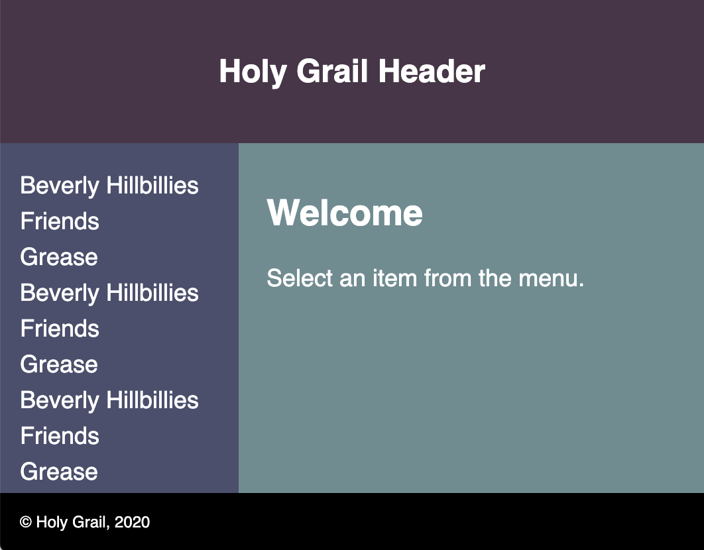
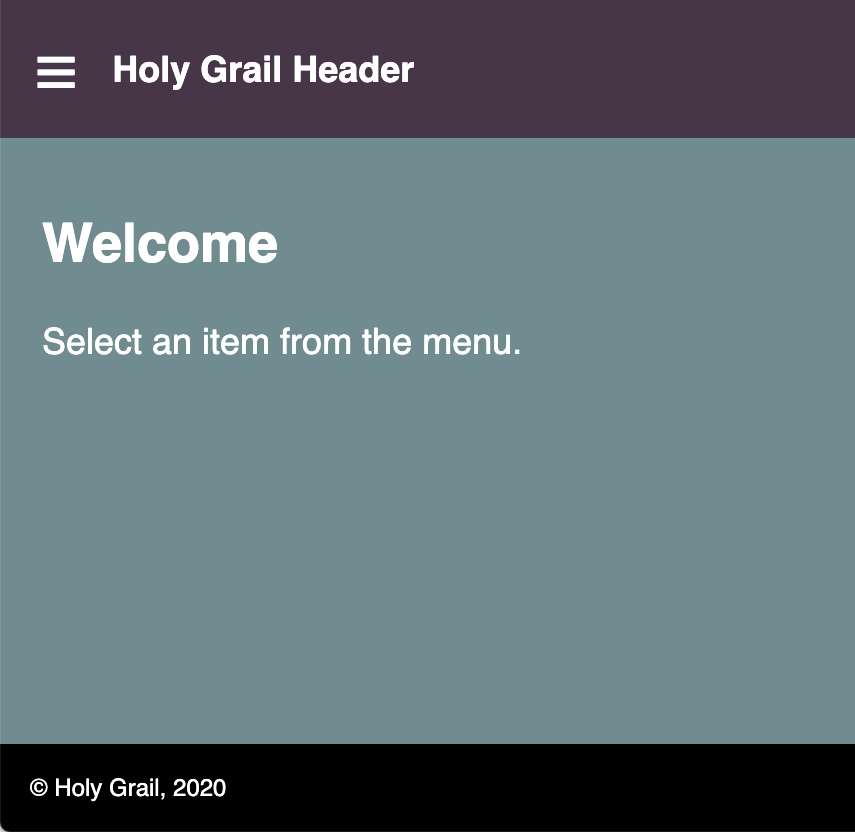
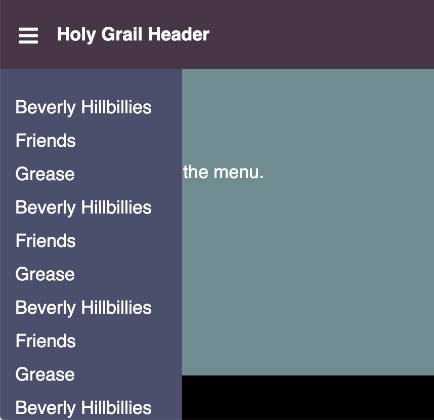

# holy-grail-html.css

This demonstrates the holy grail of HTML/CSS page layout.
The requirements are:

- a header that is always visible
- a footer that is always visible
- a left nav in desktop view that scrolls independently from the main content
- a main content area that scrolls independently of the left nav

Here's are some screenshots.
The nav items are repeated many times in order to
have enough nav content that scrolling is required.

## Desktop view

## Mobile view

## Mobile view with nav

